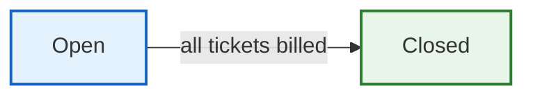

# 1. Job Order Management

A **Job Order** groups dispatch tickets under a planned maritime operation. It is the central reference point for all service activity.

## Workflow State

## Pages

### Job Orders List (Index)

- **Path:** MSAP > Job Orders
- **Table columns:** Date, Job Order #, Customer, Vessel, COS #, Voyage #, Tickets (count), Status, Actions
- **Filters:** Date range filter in card header
- **Actions:** Create, Edit, Details, Delete per row

### Create Job Order

- **Form layout:** Two-column grid
- **Left column (col-8):**
  - Customer search (type-ahead autocomplete)
  - Order Date
  - COS #, Voyage #
  - Vessel search
  - Port, Terminal (cascading dropdown)
  - Principal
  - Tugboat assignment
  - Remarks
- **Right column (col-4):**
  - Status
  - Billing info

### Edit Job Order

- Same layout as Create
- **Restriction:** Cannot edit a Job Order with status **Closed**
- Tugboat assignment/unassignment available

### Job Order Details

- Displays full Job Order info
- Lists associated Dispatch Tickets
- Media preview (signed URLs for uploaded files)
- Create new Dispatch Ticket from this screen

## Key Actions

| Action | Description |
|--------|-------------|
| Create | Register a new planned job order |
| Edit | Modify job order details (not allowed when Closed) |
| Assign Tugboat | Assign preferred tugboat to a job order |
| Unassign Tugboat | Remove tugboat assignment |
| Close | Job auto-closes when all tickets are billed |

## Tips

- Use the **Customer search** field — it searches as you type
- **Terminal** dropdown depends on the selected **Port**
- A Job Order must exist before you can create Dispatch Tickets under it
