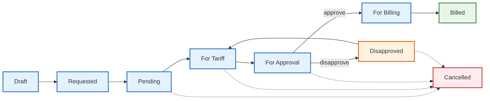

# 2. Dispatch Ticket Operations

A **Dispatch Ticket** records actual maritime service delivery — tugboat assignments, service times, crew details, and media attachments.

## Workflow State

### State Descriptions

| State | Meaning |
|-------|---------|
| **Draft** | Incomplete, still being filled in |
| **Requested** | Complete, pending review |
| **Pending** | Under review |
| **For Tariff** | Ready for rate assignment |
| **For Approval** | Tariff set, waiting for approval |
| **Disapproved** | Tariff rejected, can be revised |
| **For Billing** | Approved, ready to be billed |
| **Billed** | Included in a billing statement |
| **Cancelled** | Ticket voided |

## Pages

### Dispatch Tickets List (Index)

- **Path:** MSAP > Dispatch Tickets
- **Filters:** Status filter buttons (ALL, FOR TARIFF, FOR APPROVAL, DISAPPROVED, FOR BILLING, BILLED, DELETED) + Date range
- **Table columns:** Date, COS #, Ticket #, Start, End, Activity/Service, Port - Terminal, Tugboat, Customer, Status, Actions

### Create Dispatch Ticket

- **Form layout:** Two-column grid
- **Left column (col-8):**
  - Reference Information: Date, Job Order # (auto-populates customer/vessel/port/terminal)
  - Service Details: Activity/Service, Start Date/Time, End Date/Time, Tugboat
  - Attachments: File upload (image, video)
- **Right column (col-4):** Status, COS #

### Set Tariff / Edit Tariff

- For tickets in **For Tariff** status
- Fields: Dispatch Rate, BAF Rate, discounts, charge types
- Supports batch tariff setting from the list view

### Preview

- Read-only view of ticket details
- Media viewer for attached images/videos

## Key Actions

| Action | Description |
|--------|-------------|
| Create | New service ticket (from scratch or via Job Order) |
| Edit | Modify ticket details (status-dependent) |
| Set Tariff | Assign rates to a For Tariff ticket |
| Edit Tariff | Modify existing tariff rates |
| Approve Tariff | Approve a tariff (moves to For Billing) |
| Disapprove Tariff | Reject tariff with reason (returns to For Tariff) |
| Batch Approve | Approve multiple tariffs at once |
| Batch Set Tariff | Set rates for multiple tickets at once |
| Delete | Soft-delete a ticket |
| Restore | Restore a deleted ticket |
| Change Status | Generic status transition |

## Tips

- Tickets move through states in order — you cannot skip steps
- **Batch operations** save time when processing multiple tickets
- Media attachments show previews in the ticket detail view
- Use the filter buttons at the top to quickly find tickets by status
