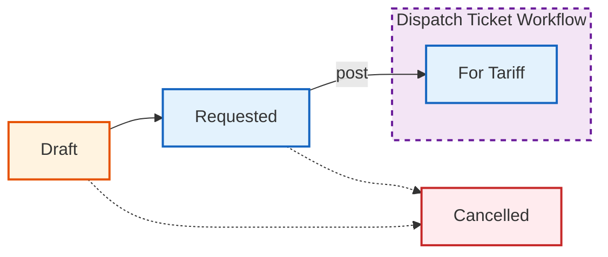

# 5. Service Requests

A **Service Request** is the initial request that may become a Dispatch Ticket. It captures service needs before rates are assigned.

## Workflow State

### State Descriptions

| State | Meaning |
|-------|---------|
| **Draft** | Incomplete request, missing some fields |
| **Requested** | Complete, ready for posting |
| **Cancelled** | Request voided |

## Pages

### Service Requests List (Index)

- **Path:** MSAP > Service Requests
- **Filters:** Status buttons (ALL, REQUESTED, DRAFT, CANCELLED) + Date range
- **Table columns:** Date, COS #, Ticket #, Start, End, Activity/Service, Port - Terminal, Tugboat, Customer, Status, Actions

### Create Service Request

- **Form layout:** Two-column grid
- **Left column (col-8):**
  - Link to Job Order (optional)
  - Auto-populated info from Job Order (Customer, Vessel, Port, Terminal, Principal)
  - Activity/Service dropdown
  - Start & End Date/Time
  - Tugboat assignment
  - Attachments: Image upload (required)
- **Right column (col-4):** Status, COS #

### Edit Service Request

- **Restriction:** Only Draft, Requested, or Cancelled statuses can be edited
- Changes re-evaluate status (Draft vs Requested)

## Key Actions

| Action | Description |
|--------|-------------|
| Create | New service request (image required) |
| Edit | Modify existing request |
| Post | Submit single request (Draft/Requested → For Tariff) |
| Post Selected | Batch post multiple requests |
| Cancel Selected | Batch cancel requests |
| Delete Image | Remove uploaded image |
| Delete Video | Remove uploaded video |

## Tips

- **Image attachment is required** when creating a request
- Link to a Job Order to auto-fill customer/vessel/port/terminal info
- Use **Post Selected** to efficiently process multiple requests at once
- Once posted, the request becomes a Dispatch Ticket in **For Tariff** status
