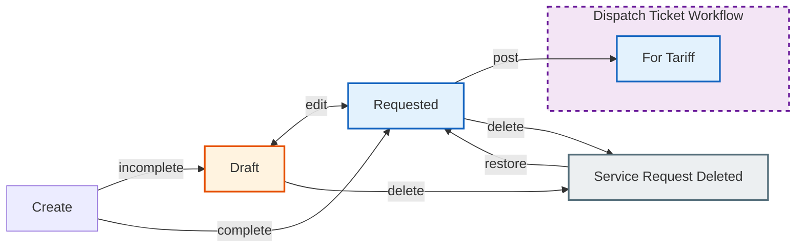

# 5. Service Requests

A **Service Request** is the initial request that may become a Dispatch Ticket. It captures service needs before rates are assigned.

## Workflow State

A Service Request lives only in its own short lifecycle. Once **posted**, it becomes a Dispatch Ticket (see [Dispatch Tickets](dispatch-ticket)) and no longer follows the Service Request flow.

### State Descriptions

| State | Meaning |
|-------|---------|
| **Draft** | Incomplete request, missing some fields |
| **Requested** | Complete, ready for posting |
| **Service Request Deleted** | Soft-deleted, can be restored |

> **Note:** A `Cancelled` status exists in the domain model but is not reachable from any UI surface, so it is not part of the documented flow.

## Pages

### Service Requests List (Index)

- **Path:** MSAP > Service Requests
- **Filters:** Status buttons (ALL, REQUESTED, DRAFT, DELETED) + Date range
- **Table columns:** Date, COS #, Ticket #, Start, End, Activity/Service, Port - Terminal, Tugboat, Customer, Status, Actions

### Create Service Request

- **Form layout:** Two-column grid
- **Left column (col-8):**
  - Link to Job Order (optional)
  - Auto-populated info from Job Order (Customer, Vessel, Port, Terminal, Principal)
  - Activity/Service dropdown
  - Start & End Date/Time
  - Tugboat assignment
  - Attachments: Image upload (required)
- **Right column (col-4):** Status, COS #

### Edit Service Request

- **Restriction:** Only **Draft** or **Requested** statuses can be edited
- Changes re-evaluate status (Draft vs Requested)

## Key Actions

| Action | Description |
|--------|-------------|
| Create | New service request (image required) |
| Edit | Modify existing request (Draft / Requested only) |
| Post | Submit a Requested request → For Tariff (from the linked Job Order) |
| Delete | Soft-delete a Draft / Requested request |
| Restore | Restore a Service Request Deleted request |
| Delete Image | Remove uploaded image |
| Delete Video | Remove uploaded video |

## Tips

- **Image attachment is required** when creating a request
- Link to a Job Order to auto-fill customer/vessel/port/terminal info
- Posting happens from the linked Job Order's ticket list — a Requested request becomes a Dispatch Ticket in **For Tariff** status
