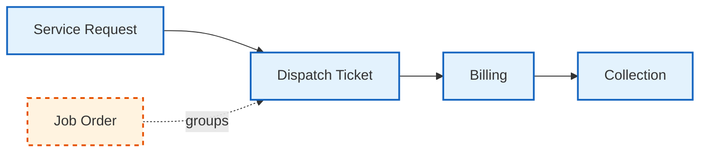

# MSAP User Manual

**MSAP** (MMSI Sales and Accounting Program) is a maritime service workflow system covering **Job Order → Dispatch Ticket → Billing → Collection**.

## Workflow Overview

| Step | Description |
|------|-------------|
| **Service Request** | Initial request for maritime service |
| **Dispatch Ticket** | Actual service delivery record |
| **Billing** | Invoice generation from delivered tickets |
| **Collection** | Payment recording against billings |
| **Job Order** | Groups dispatch tickets under a planned operation |

## Manual Sections

| #  | Module | File                             |
|----|--------|----------------------------------|
| 1  | Job Order Management | [Job Order](JobOrder)            |
| 2  | Dispatch Ticket Operations | [Dispatch Ticket](DispatchTicket) |
| 3  | Billing & Invoicing | [Billing](Billing)               |
| 4  | Collection & Payment | [Collection](Collection)         |
| 5  | Service Requests | [Service Request](ServiceRequest) |
| 6  | Master Files | Master Files                     |
| 7  | Administration (Users & Roles) | Administration                   |
| 8  | Reports | [Reports](MaritimeReport)        |
| 9  | Notifications | [Notifications](Notification)    |
| 10 | Audit Trail | [Audit](AuditTrail)              |
